# Аудит и разработка стратегии защиты конфиденциальных данных компании Медикаменте
## Задание 1. Анализ безопасности системы
### Классы конфиденциальности данных

| Класс	  | Степень конфиденциальности    | Описание	                                                                                                      | Примеры                                                                |
|:--------|:------------------------------|:---------------------------------------------------------------------------------------------------------------|:-----------------------------------------------------------------------|
| Класс 1 | Медицинская тайна (cекретные) | 	Данные, разглашение которых влечёт тяжёлые последствия: здоровье, уголовная ответственность, утрата лицензии. | Диагнозы, хронические заболевания, психиатрия, генетика, биоматериалы. |
| Класс 2 | Медицинские ПДн (высокие)     | ПДн + медицинская тайна, требующие согласия и особого контроля.                                                | ФИО + жалоба, анкета, договор, номер полиса.                           |
| Класс 3 | Контактные ПДн (средние)      | ПДн, необходимые для записи и контакта, но не раскрывающие состояние здоровья.	                                | ФИО, телефон, email, дата рождения.                                    |
| Класс 4 | Платёжные данные	             | Информация о платежах, требующая защиты по 115-ФЗ.                                                             | Сумма, способ оплаты, номер карты.                                     |
| Класс 5 | Внутренние, не-ПДн (низкий)   | Данные, не идентифицирующие пациента, бизнес-процессов.                                                        | Статистика по услугам, ТМЦ, логи (без ПДн), отчетность.                |

### Диаграммы потоков данных AS-IS

| DFD 1. Запись пациента к врачу |     DFD 2. Учёт платежей      | DFD 3. Передача анализов в лабораторию |
|:------------:|:------------:|:------------:|
| 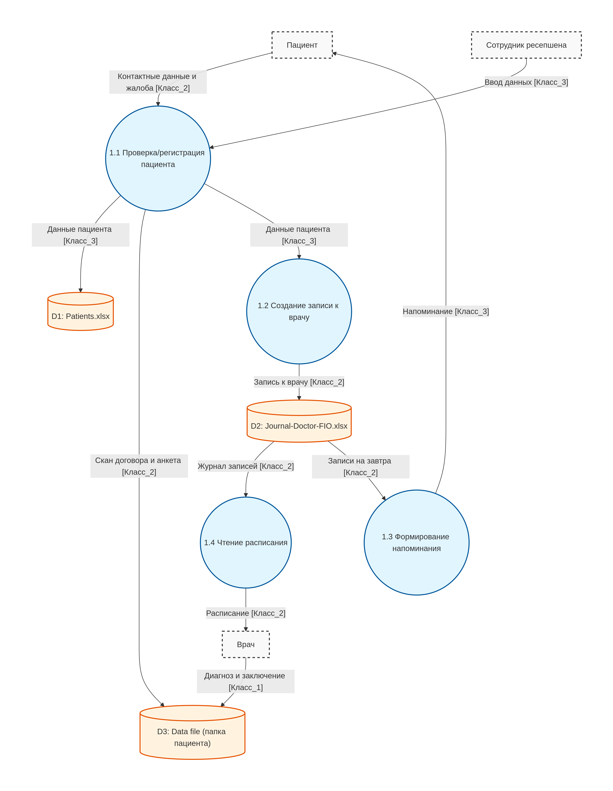 | 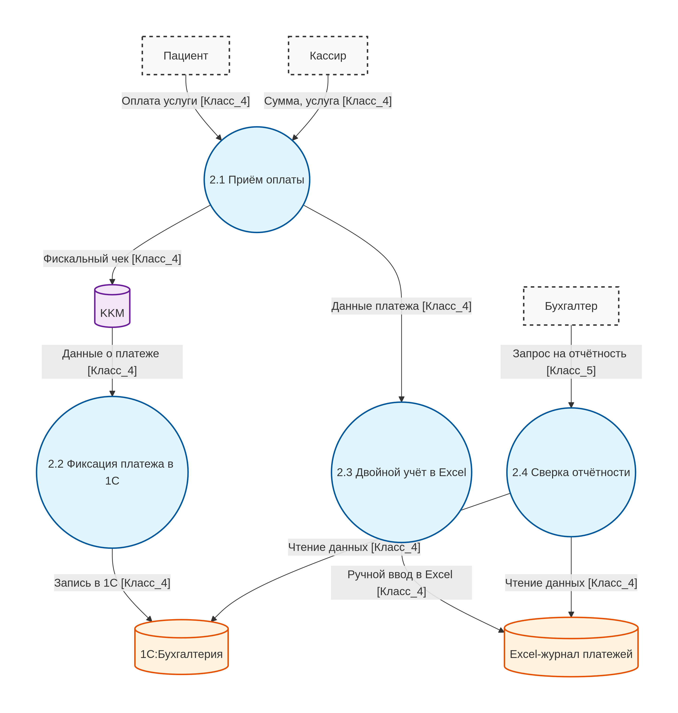 | 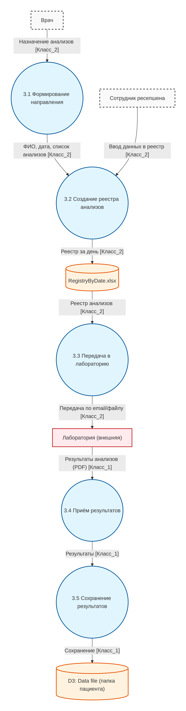 |

| DFD 4. Хранение и доступ к медицинским картам |                   DFD 5. Доступ сотрудников к ресурсам                   | DFD 6. Передача данных в 1С:Бухгалтерия (кадры, зарплаты) |
|:---------------------------------------------:|:------------------------------------------------------------------------:|:------------:|
| 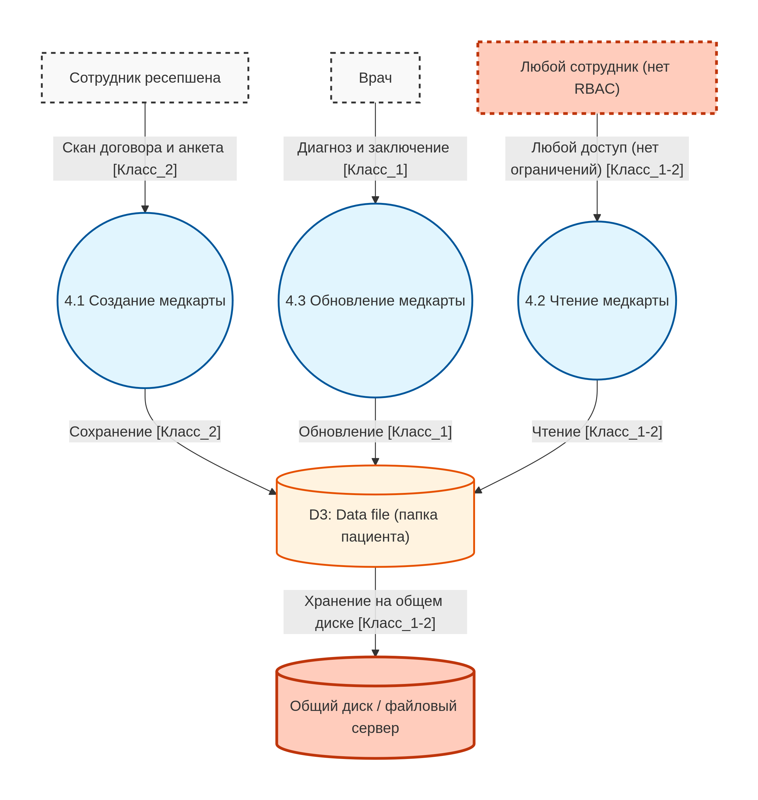 | 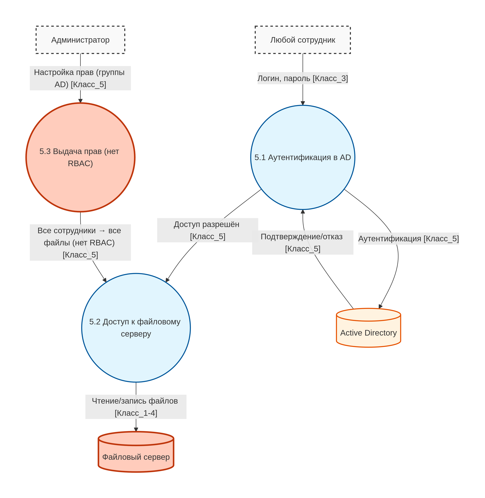 | 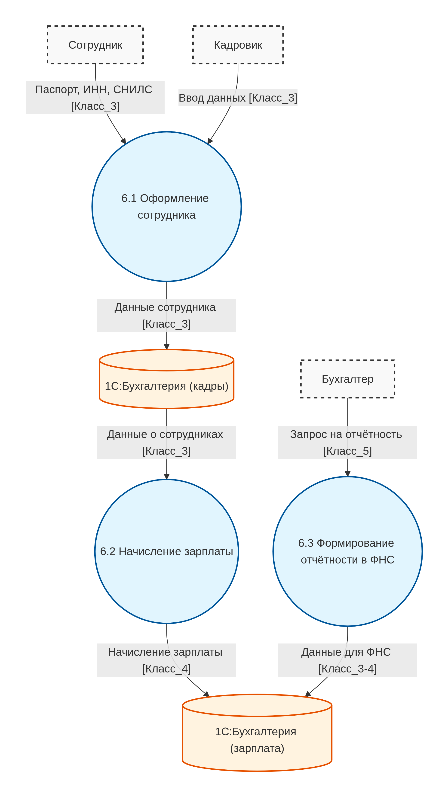 |

### Аудит

[security-audit](Task_1/security-audit.md)

### Предложения по обеспечению безопасности данных
#### Способы защиты данных

Помимо RBAC, аудита доступа:

| Данные                                                       | Класс (PHI/PII)   | Способы защиты                                             |
|--------------------------------------------------------------|-------------------|------------------------------------------------------------|
| Анамнез, Диагноз, Результаты анализов                        | Класс_1 (PHI)     | Шифрование.                                                |
| Скан договора                                                | Класс_2 (PII+PHI) | Шифрование.                                                |
| Запись к врачу                                               | Класс_2 (PII+PHI) | Шифрование, обфускация, аудит изменений.                   |
| Реестр анализов                                              | Класс_2 (PII+PHI) | Шифрование, обфускация, обезличивание.                     |
| Контактные данные (ФИО, телефон, email, адрес, место работы) | Класс_3 (PII)     | Шифрование, обфускация, обезличивание, принцип минимизации. |
| Платёжные данные                                             | Класс_4 (Finance) | Шифрование, обфускация, маскирование.                      |
| Логи                                         | Класс_5 (None)    | Токенизация, принцип минимизации. |

#### Механизм тегирования данных
##### Схема тегов данных

*_Основные теги_* 

| Тег | Возможные значения                                                | Что определяет                            |
|-----|-------------------------------------------------------------------|-------------------------------------------|
| `data_class` | 1, 2, 3, 4, 5                                                     | Уровень конфиденциальности организации    |
| `phi_type` | PHI, PII, Financial, None                                         | Тип данных по международной классификации |
| `purpose` | treatment, appointment, payment, analytics, hr, development       | Цель обработки (ст. 5 152-ФЗ)             |
| `retention_period` | 30d, 1y, 5y, archieved                                            | Срок хранения                             |

*_Теги Data Lineage_*

| Тег | Возможные значения                                 | Что определяет |
|-----|----------------------------------------------------|----------------|
| `source_system` | portal, crm, lab_api, 1c, excel, fileserver, ad    | Откуда данные пришли |
| `source_timestamp` | Datetime                     | Когда данные были созданы |
| `source_user` | user_id (или анонимизированный ID)                 | Кто ввёл/создал данные |
| `transformation` | none, anonymized, obfuscated, aggregated, encrypted | Какие изменения применены к данным |
| `lineage_parent` | ID родительской записи                             | От каких данных произошли текущие |
| `lineage_version` | 1, 2, 3...                                         | Версия данных (при изменениях) |
| `destination_system` | portal, crm, lab_api, 1c, bi, archive              | Куда данные переданы |

##### Архитектура тегирования
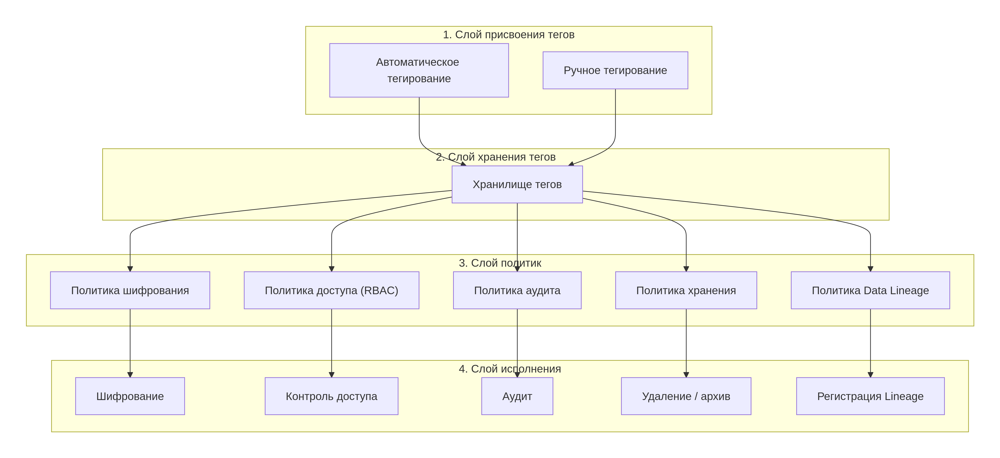

#### Меры обеспечения конфиденциальности данных

##### 1. Шифрование
*    Дисков: BitLocker, LUKS
*    Каналов: TLS 1.3, mTLS
*    БД: pgcrypto, TDE
*    Файлов: AES-256
##### 2. Контроль доступа
*    Аутентификация: Keycloak + LDAP + MFA
*    Управление доступом: RBAC / ABAC
*    Привилегированный доступ: PAM
##### 3. Аудит и мониторинг
*    Аудит файлов: SACL (Windows)
*    Сбор логов: Wazuh (SIEM)
*    Аудит 1С: встроенный журнал
*    Обезличенный аудит действий в системе
##### 4. Архитектурные меры
*    Переход от хранения в файлах к медицинскому порталу+БД (postgres)
*    Разделение доменов (медицина, данные пациентов, финансы)
*    Конфиденциальные данные изолированы и зашифрованы, не распространяются по системе.
*    Обезличенный аудит действий в системе и логи
*    Централизованная аутентификация
*    Автоматическое тегирование данных
##### 5. Обфускация и обезличивание
*    Инициалы (ФИО → И.И.) - для лаборатории
*    Обфускация телефона - для ресепшен
*    Обфускация карты (****1234) - для бухгалтера
*    Обезличивание (ID вместо ФИО) - для BI и аудита
*    Маскирование - для тестовых сред
##### 6. Организационные меры
*    Назначить DPO
*    Политика обработки ПДн
*    Отдельные согласия пациентов
*    Обучение сотрудников
*    Акт об уничтожении ПДн
##### 7. Инфраструктурные меры
*    Клиент-сервер 1С (вместо файлового режима)
*    API-шлюз (Kong / Nginx)
*    КриптоПРО для ФНС
*    VPN для удалённых сотрудников
*    Резервное копирование с шифрованием

### Диаграммы потоков данных с мерами защиты конфиденциальных данных

| DFD 1. Запись пациента к врачу |     DFD 2. Учёт платежей      | DFD 3. Передача анализов в лабораторию |
|:------------:|:------------:|:------------:|
| 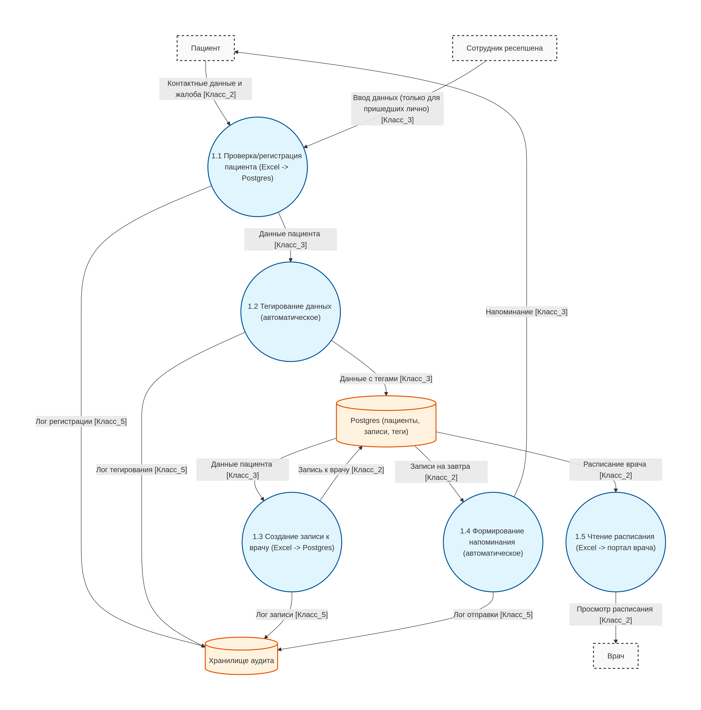 | 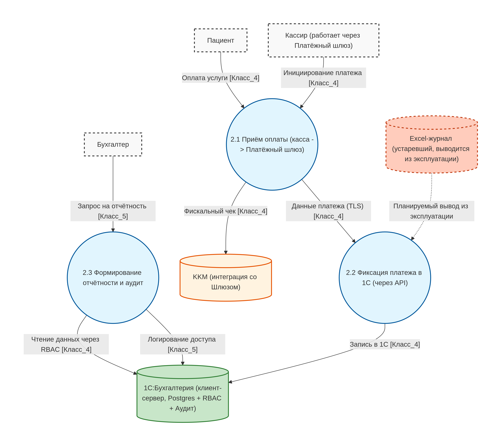 | 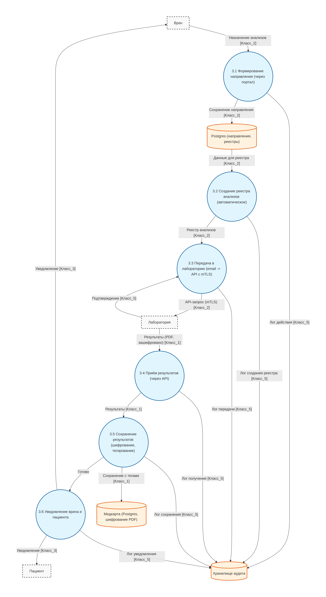 |

| DFD 4. Хранение и доступ к медицинским картам |                   DFD 5. Доступ сотрудников к ресурсам                   | DFD 6. Передача данных в 1С:Бухгалтерия (кадры, зарплаты) |
|:---------------------------------------------:|:------------------------------------------------------------------------:|:------------:|
| 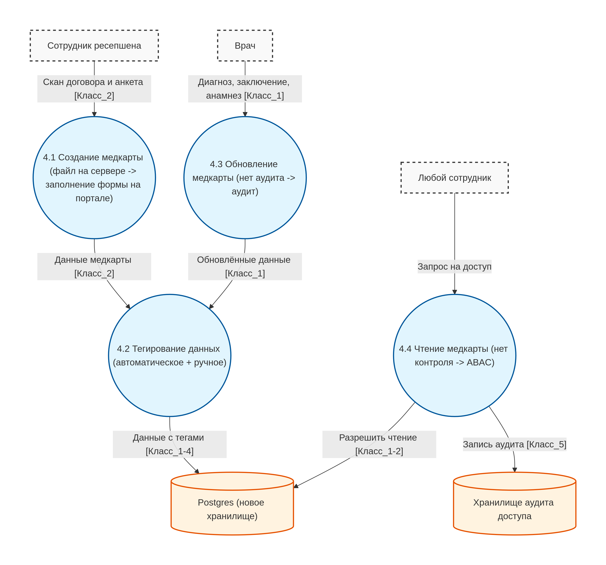 | 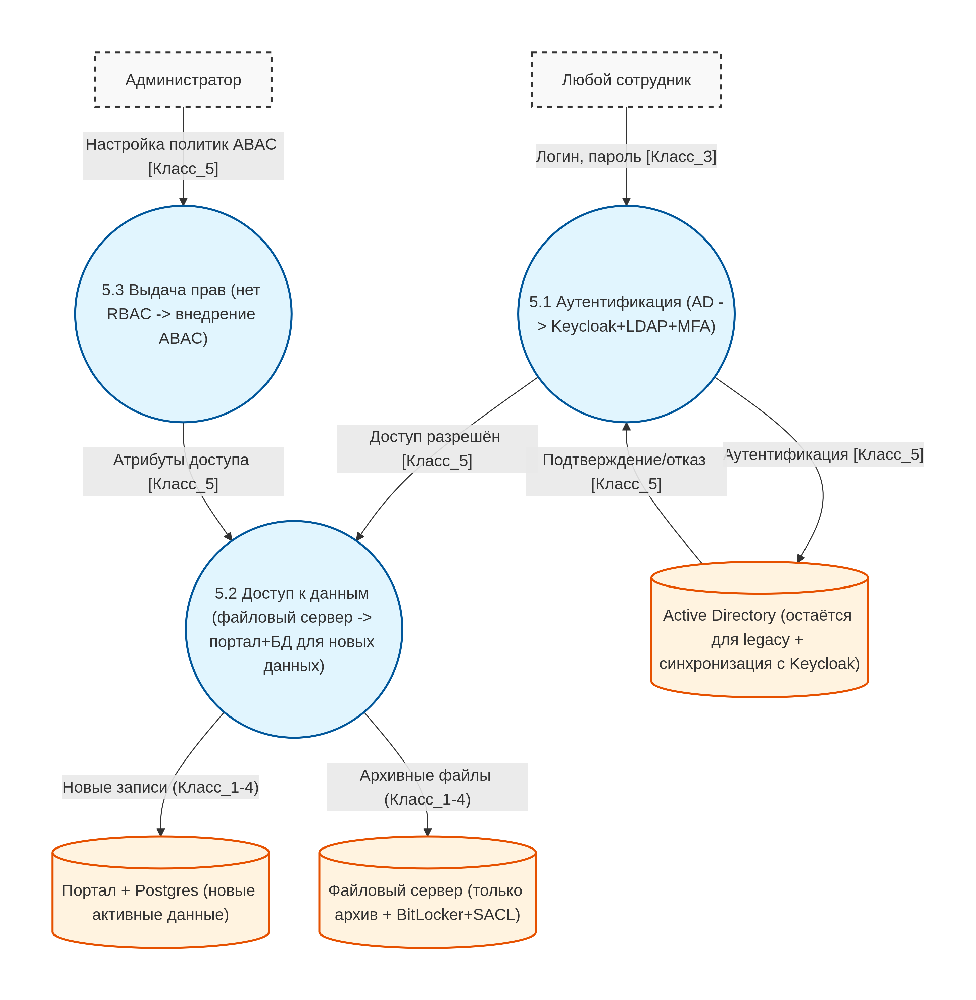 | 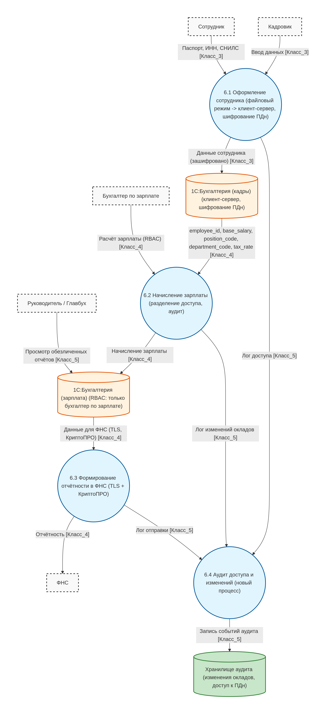 |
