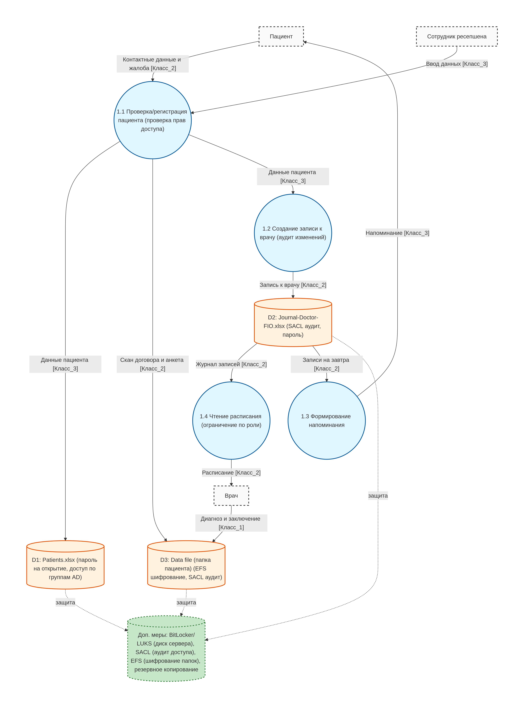
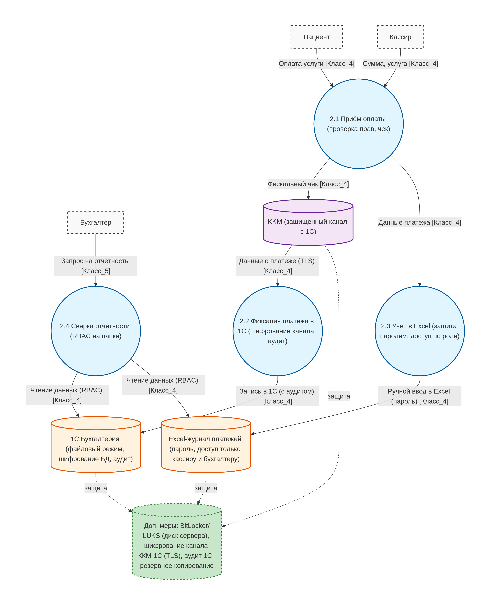
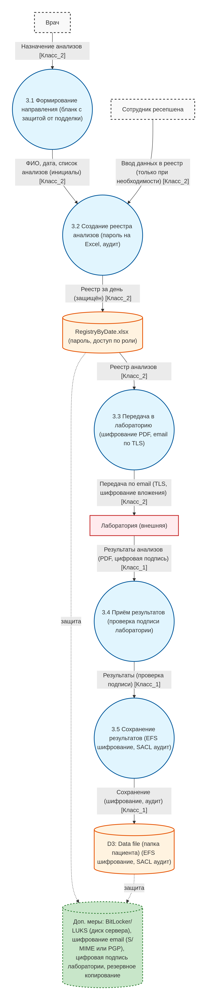
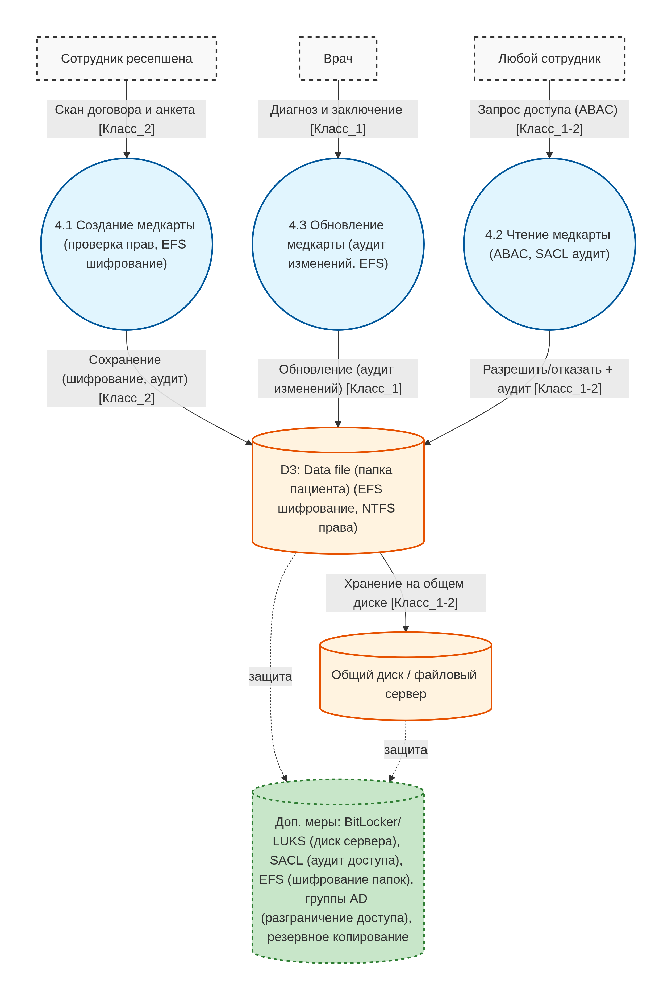
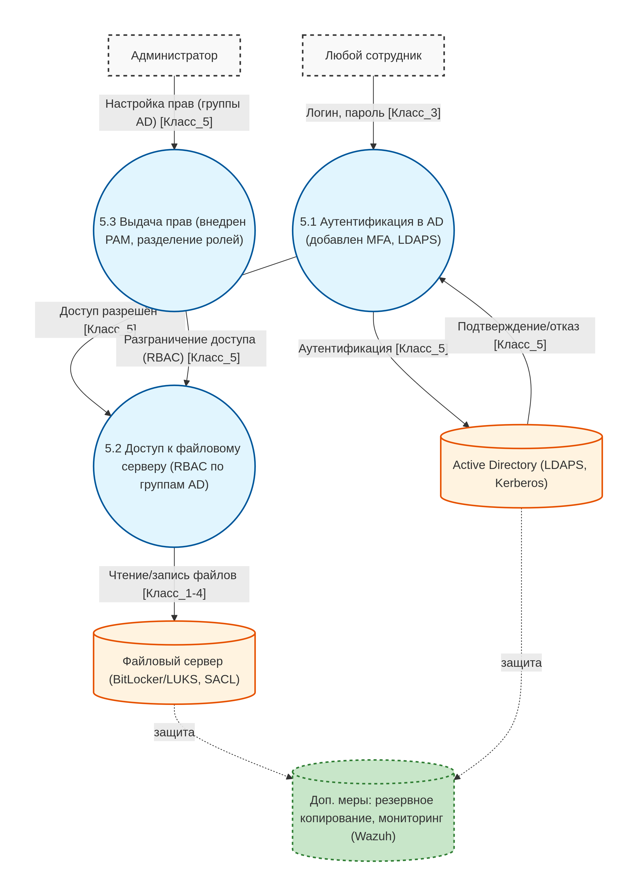
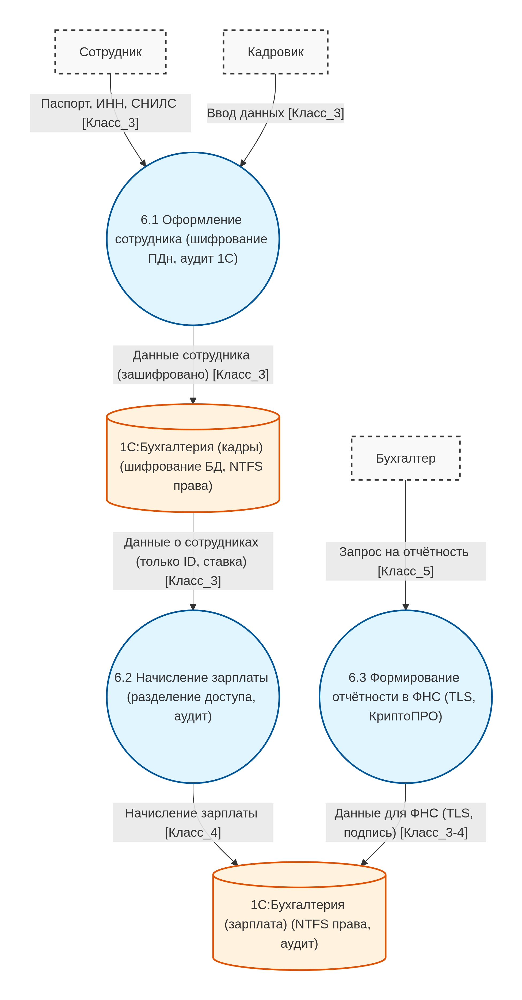
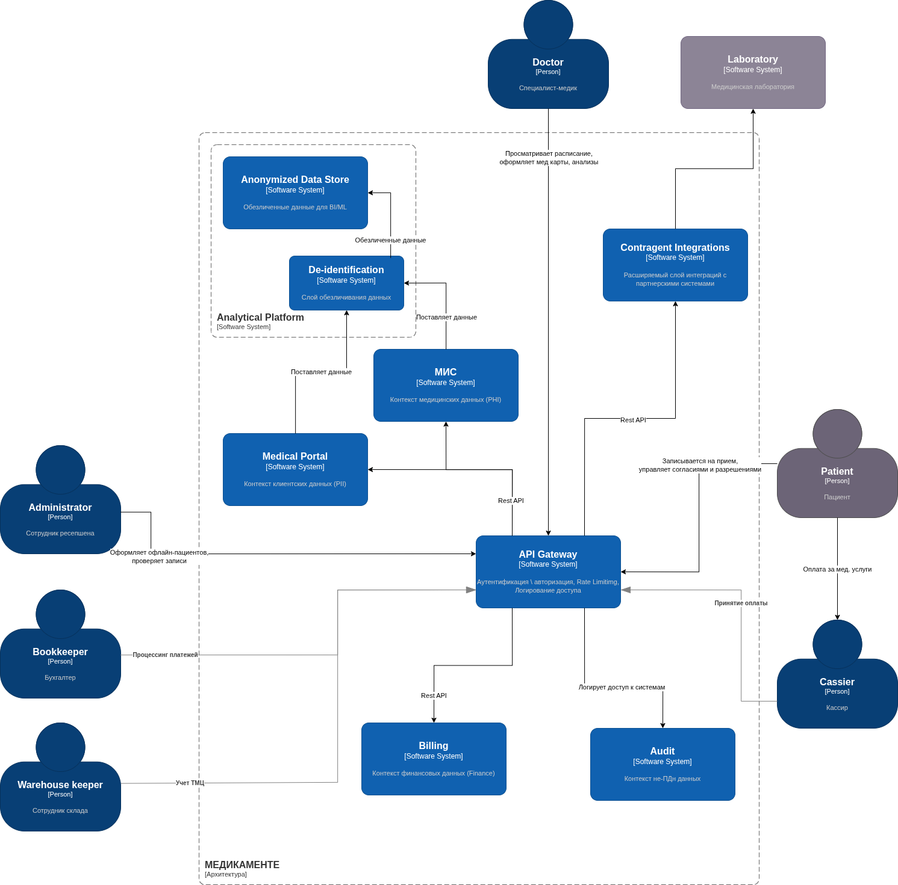
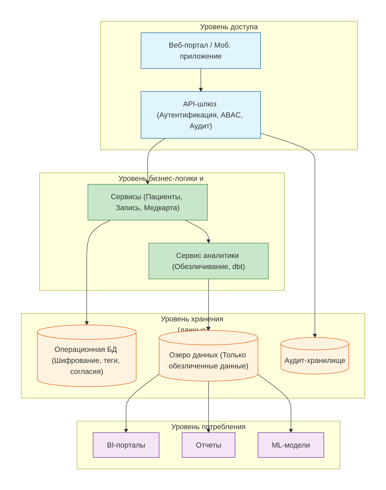
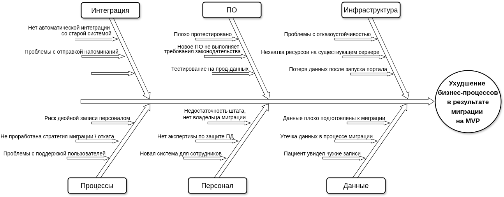
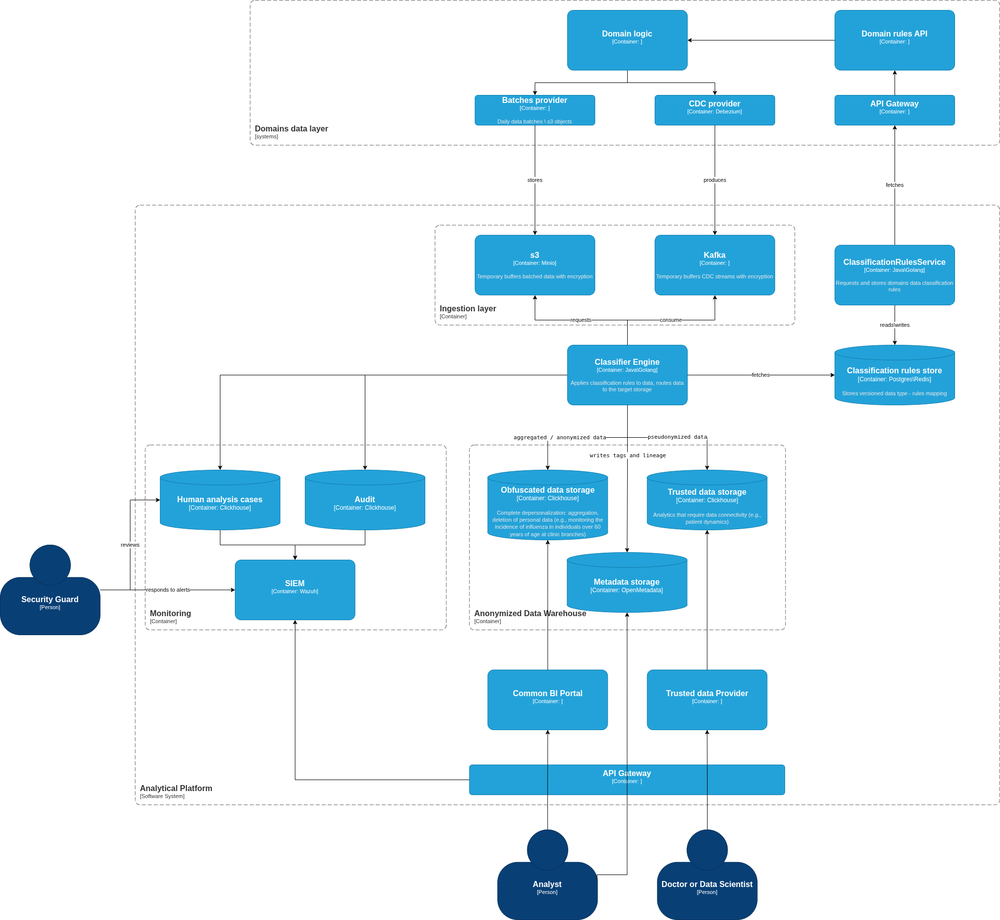

# Аудит и разработка стратегии защиты конфиденциальных данных компании Медикаменте
## Задание 1. Анализ безопасности системы
### Классы конфиденциальности данных

| Класс	  | Степень конфиденциальности    | Описание	                                                                                                      | Примеры                                                                |
|:--------|:------------------------------|:---------------------------------------------------------------------------------------------------------------|:-----------------------------------------------------------------------|
| Класс 1 | Медицинская тайна (cекретные) | 	Данные, разглашение которых влечёт тяжёлые последствия: здоровье, уголовная ответственность, утрата лицензии. | Диагнозы, хронические заболевания, психиатрия, генетика, биоматериалы. |
| Класс 2 | Медицинские ПДн (высокие)     | ПДн + медицинская тайна, требующие согласия и особого контроля.                                                | ФИО + жалоба, анкета, договор, номер полиса.                           |
| Класс 3 | Контактные ПДн (средние)      | ПДн, необходимые для записи и контакта, но не раскрывающие состояние здоровья.	                                | ФИО, телефон, email, дата рождения.                                    |
| Класс 4 | Платёжные данные	             | Информация о платежах, требующая защиты по 115-ФЗ.                                                             | Сумма, способ оплаты, номер карты.                                     |
| Класс 5 | Внутренние, не-ПДн (низкий)   | Данные, не идентифицирующие пациента, обезличенные, бизнес-процессов.                                          | Статистика по услугам, ТМЦ, логи (без ПДн), отчетность.                |

### Диаграммы потоков данных AS-IS

| DFD 1. Запись пациента к врачу |     DFD 2. Учёт платежей      | DFD 3. Передача анализов в лабораторию |
|:------------:|:------------:|:------------:|
|  |  |  |

| DFD 4. Хранение и доступ к медицинским картам |                   DFD 5. Доступ сотрудников к ресурсам                   | DFD 6. Передача данных в 1С:Бухгалтерия (кадры, зарплаты) |
|:---------------------------------------------:|:------------------------------------------------------------------------:|:------------:|
|  |  |  |

### Аудит

[security-audit](Task_1/security-audit.md)

### Предложения по обеспечению безопасности данных
#### Способы защиты данных

Помимо RBAC, аудита доступа:

| Данные                                                       | Класс (PHI/PII)   | Способы защиты                                   |
|--------------------------------------------------------------|-------------------|--------------------------------------------------|
| Анамнез, Диагноз, Результаты анализов                        | Класс_1 (PHI)     | Шифрование.                                      |
| Скан договора                                                | Класс_2 (PII+PHI) | Шифрование.                                      |
| Запись к врачу                                               | Класс_2 (PII+PHI) | Шифрование, обфускация, аудит изменений.         |
| Реестр анализов                                              | Класс_2 (PII+PHI) | Шифрование, обфускация, обезличивание.           |
| Контактные данные (ФИО, телефон, email, адрес, место работы) | Класс_3 (PII)     | Шифрование, принцип минимизации.                 |
| Платёжные данные                                             | Класс_4 (Finance) | Шифрование, обфускация, маскирование.            |
| Логи                                         | Класс_5 (None)    | Токенизация, обезличивание, принцип минимизации. |

#### Механизм тегирования данных
##### Схема тегов данных

*_Основные теги_* 

| Тег | Возможные значения                                                | Что определяет                            |
|-----|-------------------------------------------------------------------|-------------------------------------------|
| `data_class` | 1, 2, 3, 4, 5                                                     | Уровень конфиденциальности организации    |
| `phi_type` | PHI, PII, Financial, None                                         | Тип данных по международной классификации |
| `purpose` | treatment, appointment, payment, analytics, hr, development       | Цель обработки (ст. 5 152-ФЗ)             |
| `retention_period` | 30d, 1y, 5y, archieved                                            | Срок хранения                             |

*_Теги Data Lineage_*

| Тег | Возможные значения                               | Что определяет |
|-----|--------------------------------------------------|----------------|
| `source_system` | portal, crm, lab_api, 1c, excel, fileserver    | Откуда данные пришли |
| `source_timestamp` | Datetime                     | Когда данные были созданы |
| `source_user` | user_id (или анонимизированный ID)               | Кто ввёл/создал данные |
| `transformation` | none, anonymized, obfuscated, aggregated, encrypted | Какие изменения применены к данным |
| `lineage_parent` | ID родительской записи                           | От каких данных произошли текущие |
| `lineage_version` | 1, 2, 3...                                       | Версия данных (при изменениях) |
| `destination_system` | portal, crm, lab_api, 1c, bi, archive            | Куда данные переданы |

#### Меры обеспечения конфиденциальности данных

##### 1. Шифрование
*    Дисков: BitLocker, LUKS
*    Каналов: TLS 1.3, mTLS
*    БД: pgcrypto, TDE
*    Файлов: AES-256
##### 2. Контроль доступа
*    Аутентификация: Keycloak + LDAP + MFA
*    Управление доступом: RBAC / ABAC
*    Привилегированный доступ: PAM
##### 3. Аудит и мониторинг
*    Аудит файлов: SACL (Windows)
*    Сбор логов: Wazuh (SIEM)
*    Аудит 1С: встроенный журнал
*    Обезличенный аудит действий в системе
##### 4. Архитектурные меры
*    Переход от хранения в файлах к медицинскому порталу+БД (postgres)
*    Разделение доменов (медицина, данные пациентов, финансы)
*    Конфиденциальные данные изолированы и зашифрованы, не распространяются по системе.
*    Обезличенный аудит действий в системе и логи
*    Централизованная аутентификация
*    Автоматическое тегирование данных
##### 5. Обфускация и обезличивание
*    Инициалы (ФИО → И.И.) - для лаборатории
*    Обфускация карты (****1234) - для бухгалтера
*    Обезличивание (ID вместо ФИО) - для BI и аудита
*    Маскирование - для тестовых сред
##### 6. Организационные меры
*    Назначить DPO
*    Политика обработки ПДн
*    Отдельные согласия пациентов
*    Обучение сотрудников
*    Акт об уничтожении ПДн
##### 7. Инфраструктурные меры
*    Клиент-сервер 1С (вместо файлового режима)
*    API-шлюз (Kong / Nginx)
*    КриптоПРО для ФНС
*    VPN для удалённых сотрудников
*    Резервное копирование с шифрованием

### Диаграммы потоков данных с мерами защиты конфиденциальных данных (минимальные действия в текущей системе)

|                 DFD 1. Запись пациента к врачу                  |     DFD 2. Учёт платежей      | DFD 3. Передача анализов в лабораторию |
|:---------------------------------------------------------------:|:------------:|:------------:|
|  |  |  |

| DFD 4. Хранение и доступ к медицинским картам |                   DFD 5. Доступ сотрудников к ресурсам                   | DFD 6. Передача данных в 1С:Бухгалтерия (кадры, зарплаты) |
|:---------------------------------------------:|:------------------------------------------------------------------------:|:------------:|
|  |  |  |

## Цели бизнеса
Компания стремится обеспечить конфиденциальность, целостность и доступность данных — это приоритет «Медикаменте», который диктует подход к остальным трём целям компании:
1. Интеграция лаборатории анализов с API.
2. Расширение направления обработки данных (новые сервисы на базе BI-, ML- и AI-технологий).
3. Разработка новых систем и миграция.

## Задание 2. Проектирование решения

| Принцип                                                        | Описание                                                                                                                                                                                                                                                                        | Реализация                                                                                                                                                                                          |
|:---------------------------------------------------------------|:--------------------------------------------------------------------------------------------------------------------------------------------------------------------------------------------------------------------------------------------------------------------------------|:----------------------------------------------------------------------------------------------------------------------------------------------------------------------------------------------------|
| **1. Proactive not Reactive;   Preventative not Remedial** | Прогнозирование потенциальных рисков и внедрение защитных мер на протяжении всего жизненного цикла системы                                                                                                                                                                      | Безопасность заложена в архитектуру изначально: API-шлюз, отдельные сервисы для разных уровней конфиденциальности данных и аналитический слой - это архитектурные решения, а не костыли и заплатки. |
| **2. Privacy as the Default Setting**                          | Защита персональных данных осуществляется автоматически.                                                                                                                                                                                                                        | Для аналитики по умолчанию доступны только обезличенные данные из Data Lake.                                                                                                                        |
| **3. Privacy Embedded into Design**                                | Конфиденциальность должна быть неотъемлемой частью архитектуры и дизайна системы, а не дополнительной функцией.                                                                                                                                                                 | Политика ABAC и проверка согласий встроены в логику API-шлюза и Сервиса пациентов. Без них система просто не работает.                                                                              |
| **4. Full Functionality: Positive-Sum, not Zero-Sum**              | Принципы конфиденциальности не должны противоречить другим целям, таким как безопасность или удобство использования. Необходимо обеспечить баланс.                                                                                                                              | Аналитический слой не урезан, он просто работает с обезличенными данными, что позволяет делать бизнес-аналитику, не нарушая закон.                                                                  |
| **5. End-to-End Security: Full Lifecycle Protection**              | Под этим принципом подразумевается обеспечение защиты персональных данных на протяжении всего их жизненного цикла - от момента сбора данных до безопасного уничтожения. Сюда входят данные в состоянии покоя, при переносе и в процессе использования.                          | Данные зашифрованы в БД, защищены при передаче (TLS внутри системы и с внешними сервисами), доступ строго контролируется.                                                                           |
| **6. Visibility and Transparency**                                 | Системы и процессы должны быть прозрачными для пользователей и других заинтересованных сторон. Для этого организациям нужно открыто рассказывать о своих методах работы с данными и предоставлять возможность независимой проверки своих мер по обеспечению конфиденциальности. | Все действия с данными логируются API-шлюзом. Это основа для аудита и расследования инцидентов.                                                                                                     |
| **7. Respect for User Privacy**                                | Этот принцип подчёркивает необходимость соблюдения интересов пользователя на первом месте.                                                                                                | Пациент через портал может управлять своими согласиями и инициировать запрос на удаление данных ("право на забвение").                                                                              |

## Задание 3. Оценка Data Encryption at Rest and In Transit
[data-encryption.md](Task_3/data-encryption.md)

## Задание 4. Оценка узких мест при миграции
_В компании планируется миграция устаревшей монолитной системы на современную архитектуру (например, на микросервисную). В процессе перехода необходимо выявить потенциально узкие места, которые могут негативно повлиять на работоспособность нового решения._

_Промежуточное состояние (через пару месяцев). MVP, в котором клиент сможет самостоятельно записаться на приём к специалисту через портал компании. При этом команда ресепшена будет видеть эту запись: сотрудники смогут отследить запись в системе и за день до приёма напомнить про него и пациенту, и специалисту. Необходимо определить категории данных пациентов и разнести их по различным доменам. Для каждой категории данных определить роли (RBAC) или атрибуты (ABAC), на основании которых сотрудникам будет разрешён доступ к данным._

[migration-risks.md](Task_4/mvp-migration-risks.md)

## Задание 5. Разработка cutover-плана
[mvp-migration-method.md](Task_5/mvp-migration-method.md)

[mvp-migration-plan.md](Task_5/mvp-migration-plan.md)

## Задание 6. Классификация данных

_Ваша задача — добавить движок для классификации данных перед их загрузкой в хранилище. Для этого предложите в целевой архитектуре слой, который обеспечивает аналитическую работу с данными системы с учётом принципов Privacy by Design._

| Слой             |Ключевая защита| Что хранится                                                                                                                 | Назначение                                                   | Пример                                                                                      |
|:-----------------|:------------|:-----------------------------------------------------------------------------------------------------------------------------|:-------------------------------------------------------------|:--------------------------------------------------------------------------------------------|
| Trusted layer    |Псевдонимизация + ABAC + аудит| Слой где хранятся конфиденциальные данные, но в псевдонимизированной форме. Доступ к ним строго контролируется (ABAC, аудит) | Аналитика, требующая связности данных (динамика по пациенту) | Исследование эффективности лечения: динамика по одному пациенту (но без ФИО) Аудит врача                    |
| Obfuscated layer |Полное обезличивание (агрегация, удаление ПДн)| Слой, где данные обезличены по умолчанию                                                                                     | BI, ML, отчёты, тестирование |  Мониторинг заболеваемости гриппом лиц старше 60 лет по филиалам клиники                    |